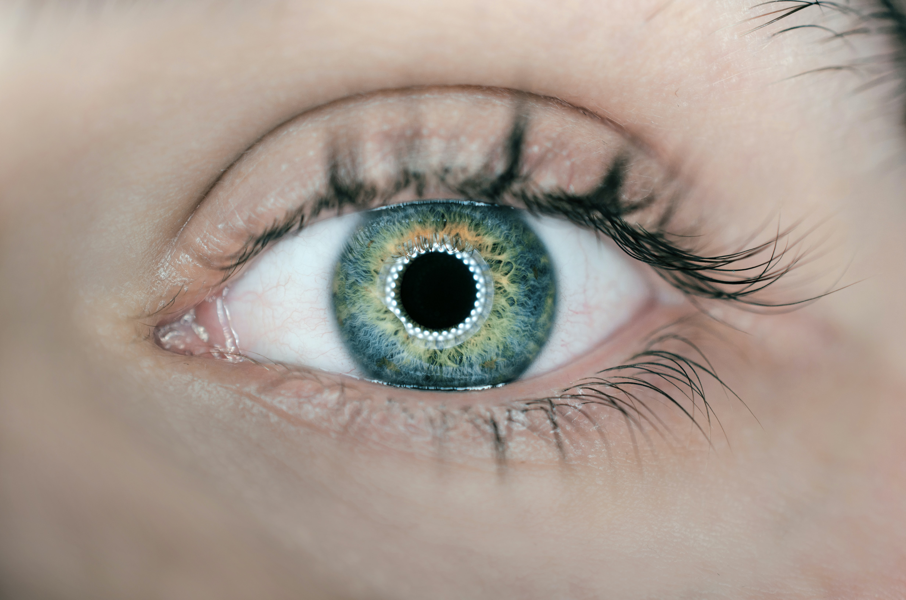
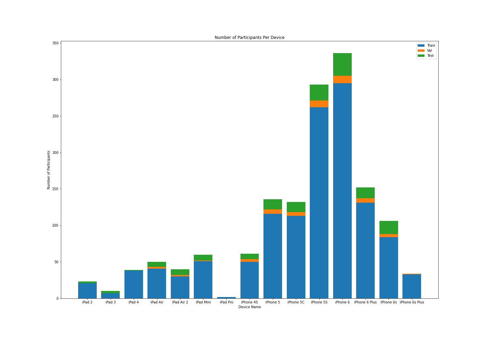
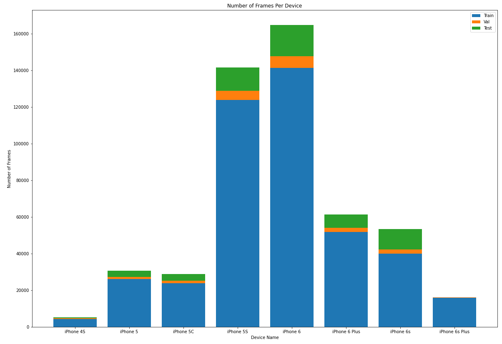
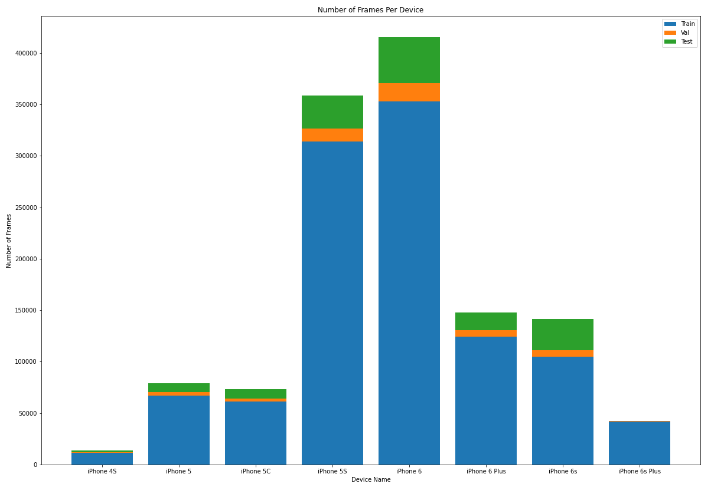
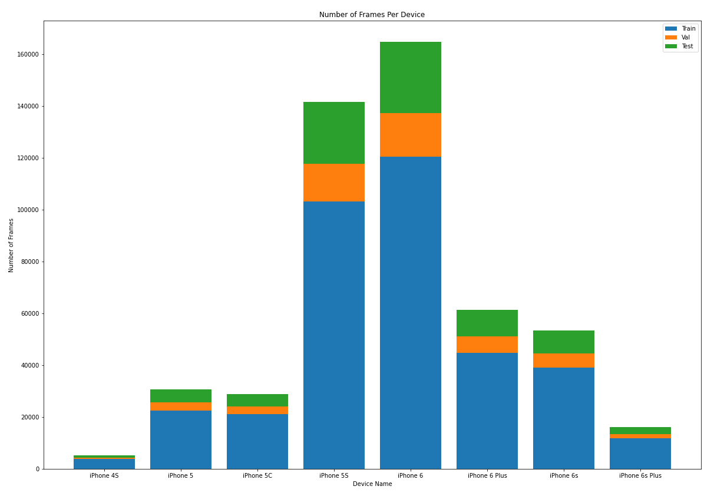
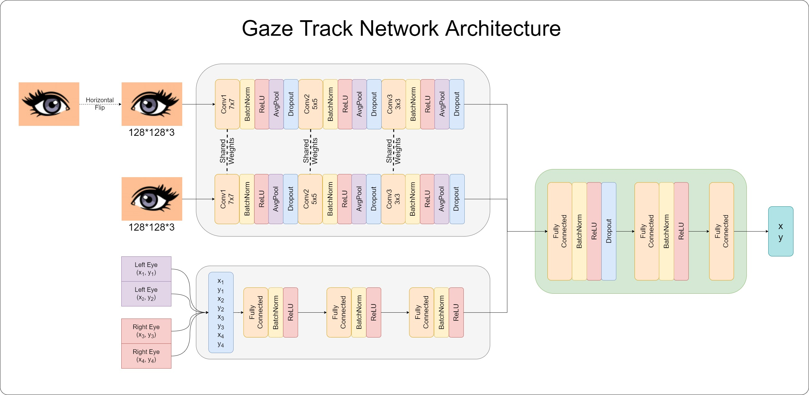

# Gaze Track

Welcome to the complete guide for the implementation and experiments based on Google's recent paper [Accelerating eye movement research via accurate and affordable smartphone eye tracking](https://www.nature.com/articles/s41467-020-18360-5). 

Please use this index to quickly jump to the portions that interest you most.
- [Introduction](#introduction)
- [The Dataset](#the-dataset)
  * [Raw Dataset Numbers](#raw-dataset-numbers)
  * [Key Point Generation](#key-point-generation)
  * [MIT Split](#mit-split)
    + [Only Phone Only Portrait](#only-phone-only-portrait)
    + [Only Phones All Orientations](#only-phones-all-orientations)
  * [Google Split](#google-split)
  * [Test Split SVR 13 Point Calibration](#test-split-svr-13-point-calibration)
  * [Test Split Google](#test-split-google)
- [The Network](#the-network)
- [Training](#training)
- [Results](#results)
- [Experiments](#experiments)
- [References](#references)
- [Acknowledgements](#acknowledgements)

***

## Introduction
Eye tracking has many applications from driver safety to improved accessibility for people with disabilities. Current state of the art eye trackers are very expensive and tend to be bulky systems that need to be carefully setup and calibrated. The pervasiveness of handheld devices with powerful cameras have now made it possible to have high quality eye tracking right in our pockets!

The paper implemented here reports an error of 0.6–1° at a viewing distance of 25–40cm for a smartphone. This means if you look at a spot on the phone from a distance of 25–40cm, the algorithm can predict the location of the spot within an error of 0.46±0.03cm.

The authors have not open sourced code or provided trained models. The aim of this project therefore is to replicate the results reported and then extend the functionality to also predict head position and more.

***

## The Dataset
All trained models provided in this project are trained on some subset of the massive [MIT GazeCapture dataset](https://gazecapture.csail.mit.edu/index.php) that was released in 2016. You can access the dataset by registering on the website. 

### Raw Dataset Numbers
The figure below shows the number of participants per device as well as the train/val/test split as provided by the GazeCapture team. 

Details of the file structure within the dataset and what information is contained are explained very well at the [Official GazeCapture git repo](https://github.com/CSAILVision/GazeCapture). 

For training the network and the different experiments, we split this large dataset based on a variety of filters and train/test/val combinations. These splits and how to generate them using the code are briefly described below. 

### Key Point Generation
Since the Google Model requires eye landmark key points that are not included in the GazeCapture dataset, converting from GazeCapture to a dataset usable for this project is a two step process. 
1. Extract gazecapture.tar to a temp folder
2. Extract *.tar.gz into the same temp folder
3. Use one of the dataset conversion scripts in `Utils/dataset_converter*` to change the folder structure to a usable one 
4. Use the [Utils/add_eye_kp.py](https://github.com/DSSR2/gaze-track/blob/main/Utils/add_eye_kp.py) file to generate the key points. 

### MIT Split
All frames that make it to the final dataset contains only those frames that have a valid face detection along with valid eye detections. If any one of the 3 detections are not present, the frame is discarded. 

The _MIT Split_ maintains the train test validation split at a per participant level, same as what GazeCapture does. What this means is that a data from one participant does not appear in more than one of the train/test/val sets. We have different participants in the train, val and test sets. This ensures that the trained model is truly robust and can generalize well.

You can use the [Utils/dataset_converter_mit_split.py](https://github.com/DSSR2/gaze-track/blob/main/Utils/dataset_converter_mit_split.py) file to generate the two datasets mentioned below.

#### Only Phone Only Portrait
The first dataset we will discuss is the closest to what Google used to train their model. We apply the following filters:
* Only phone data
* Only portrait orientation
* Valid face detections
* Valid eye detections 

This dataset is what the [provided base model](https://github.com/DSSR2/gaze-track/blob/main/Checkpoints/GoogleCheckpoint_MITSplit.ckpt) is trained on. 

The figure below shows the distribution of number of frames per device. 

Overall, there were
* 501,735 Total frames from 1,241 participants
* 427,092 Train frames from 1,075  participants
* 19,102 Validation frames from 45 participants
* 55,541 Test frames from 121 participants

#### Only Phones All Orientations
The next dataset continues to split the data as suggested by GazeCapture but includes all the orientations. The following filters are applied: 
* Only phone data
* Valid face detections
* Valid eye detections

This dataset is used to train the model described in the `Experiments` folder. 

The figure below shows the distribution of number of frames per device. 

Overall, there were
* 1,272,185 Total frames from 1247 participants 
* 1,076,797 Train frames from 1081 participants
* 51,592 Validation frames from 45 participants
* 143,796 Test frames from 121 participants

### Google Split
Google split their dataset according to the unique ground truth points. This therefore means that frames from each participant are present in the train test and validation sets. To ensure no data leaks though, frames related to a particular ground truth point do not appear in more than one set. The split is also a random 70/10/15 train/val/test split compared to a 13 point calibration split. 

This dataset is what the [GoogleSplit Model](https://github.com/DSSR2/gaze-track/blob/main/Checkpoints/GoogleCheckpoint_GoogleSplit.ckpt) is trained on.

The figure below shows the distribution of number of frames per device. 

You can use the [Utils/dataset_converter_google_split.py](https://github.com/DSSR2/gaze-track/blob/main/Utils/dataset_converter_google_split.py) file to generate this dataset.

Overall, there were
* 501,735 Total frames from 1,241 participants
* 366,940 Train frames from 1,241  participants
* 50,946 Validation frames from 1,219 participants
* 83,849 Test frames from 1,233 participants

### Test Split SVR 13 Point Calibration

### Test Split Google
***

## The Network
We reproduce the network as provided in the Google paper and the supplementary information. 

The figure below shows the network architecture. 

***

## Training
We use PyTorch Lightning to train our model. We leverage multiple GPUs and make sure to use all the resources available. Since the network is relatively small ~140K parameters, training speeds are fast. 

We use an Exponential Learning rate scheduler. Experiments were carried out with Exponential LR, Reduce LR on Plateau and no LR schedulers. The Exponential LR scheduler provided the best model. This is also similar to what Google mentions in their paper. 

***

## Results
The table below summarizes the results obtained using the trained models provided. 

These results are slightly worse than Google's reported errors since we have less restrictions on our data. 
<table>
<thead>
  <tr>
    <th>Model Name</th>
    <th>Dataset Name</th>
    <th>Number of Overall Test Files</th>
    <th>Test Error Overall (cm)</th>
    <th>Number of Non Calibration Test Points</th>
    <th>Test Error Non Calibration Points (cm)</th>
  </tr>
</thead>
<tbody>
  <tr>
    <td rowspan="7">GoogleCheckpoint_MITSplit.ckpt</td>
    <td>MIT Split; All phones, Only portrait</td>
    <td>55,541</td>
    <td>2.038 cm</td>
    <td>33,674</td>
    <td>1.92 cm</td>
  </tr>
  <tr>
    <td>MIT Split; Only iPhone 4S, Only portrait</td>
    <td>522</td>
    <td>2.04 cm</td>
    <td>NA</td>
    <td>NA</td>
  </tr>
  <tr>
    <td>MIT Split; Only iPhone 5, Only portrait</td>
    <td>3,362</td>
    <td>1.75 cm</td>
    <td>1,883</td>
    <td>1.61 cm</td>
  </tr>
  <tr>
    <td>MIT Split; Only iPhone 5S, Only portrait</td>
    <td>12,648</td>
    <td>1.95 cm</td>
    <td>7,158</td>
    <td>1.85 cm</td>
  </tr>
  <tr>
    <td>MIT Split; Only iPhone 5C, Only portrait</td>
    <td>3,643</td>
    <td>1.87 cm</td>
    <td>2,072</td>
    <td>1.70 cm</td>
  </tr>
  <tr>
    <td>MIT Split; Only iPhone 6, Only portrait</td>
    <td>16,993</td>
    <td>2.05 cm</td>
    <td>9,683</td>
    <td>1.98 cm</td>
  </tr>
  <tr>
    <td>MIT Split; Only iPhone 6S, Only portrait</td>
    <td>11,178</td>
    <td>1.91 cm</td>
    <td>7,777</td>
    <td>1.75 cm</td>
  </tr>
  <tr>
    <td>GoogleCheckpoint_GoogleSplit.ckpt</td>
    <td>Google Split; All phones, Only portrait</td>
    <td>83,849</td>
    <td>1.86cm</td>
    <td>NA</td>
    <td>NA</td>
  </tr>
</tbody>
</table>

***

## Experiments

***

## References

*** 

## Acknowledgements