# Gaze Track
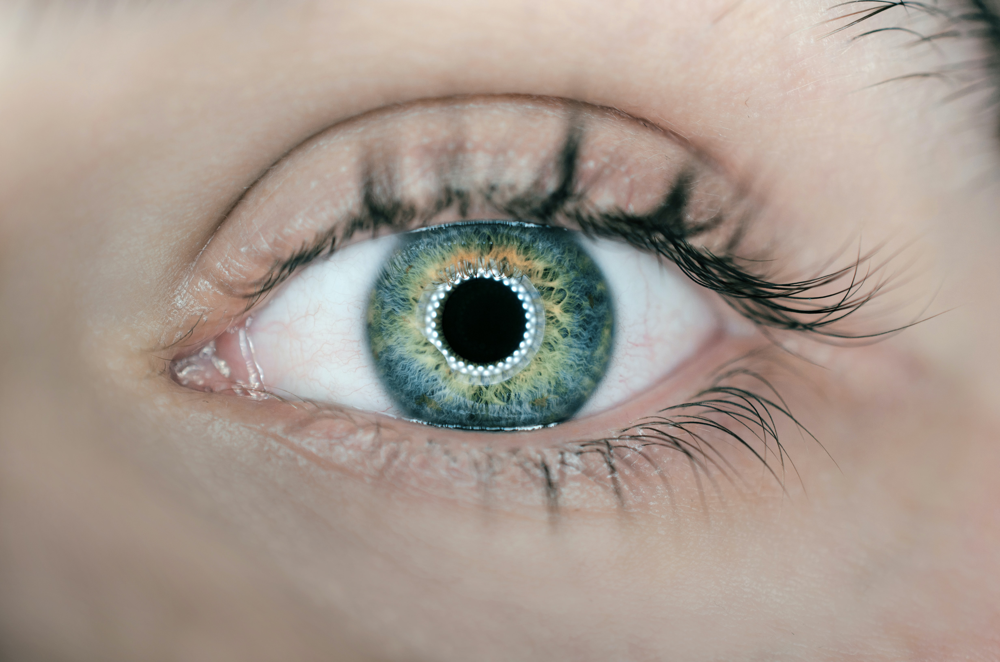

Welcome to the complete guide for the implementation and experiments based on Google's recent paper [Accelerating eye movement research via accurate and affordable smartphone eye tracking](https://www.nature.com/articles/s41467-020-18360-5). 

Please use this index to quickly jump to the portions that interest you most.
- [Introduction](#introduction)
- [The Dataset](#the-dataset)
  * [Raw Dataset Numbers](#raw-dataset-numbers)
  * [Key Point Generation](#key-point-generation)
  * [MIT Split](#mit-split)
    + [Only Phone Only Portrait](#only-phone-only-portrait)
    + [Only Phones All Orientations](#only-phones-all-orientations)
  * [Google Split](#google-split)
  * [Test Set](#test-set)
    + [13 Point Calibration Split for SVR Training](#13-point-calibration-split-for-svr-training)
  * [70/30 Split for SVR Training](#70-30-split-for-svr-training)
- [The Network](#the-network)
- [Training](#training)
- [Results](#results)
  * [Base Model Results](#base-model-results)
  * [SVR Personalization](#svr-personalization)
    + [13 Point Calibration Split](#13-point-calibration-split)
    + [Google 70/30 Train Test Split](#google-70-30-train-test-split)
  * [SVR Outputs](#svr-outputs)
  * [Affine Transform Based Personalization](#affine-transform-based-personalization)
- [Experiments](#experiments)
  * [Network Architecture](#network-architecture)
  * [Dataset](#dataset)
  * [Training](#training-1)
  * [Results](#results-1)
- [References](#references)
- [Acknowledgements](#acknowledgements)

***

## Introduction
Eye tracking has many applications from driver safety to improved accessibility for people with disabilities. Current state of the art eye trackers are very expensive and tend to be bulky systems that need to be carefully setup and calibrated. The pervasiveness of handheld devices with powerful cameras have now made it possible to have high quality eye tracking right in our pockets!

The paper implemented here reports an error of 0.6–1° at a viewing distance of 25–40cm for a smartphone. This means if you look at a spot on the phone from a distance of 25–40cm, the algorithm can predict the location of the spot within an error of 0.46±0.03cm.

The authors have not open sourced code or provided trained models. The aim of this project therefore is to replicate the results reported and then extend the functionality to also predict head position and more.


***

## The Dataset
All trained models provided in this project are trained on some subset of the massive [MIT GazeCapture dataset](https://gazecapture.csail.mit.edu/index.php) that was released in 2016. You can access the dataset by registering on the website. 

### Raw Dataset Numbers
The figure below shows the number of participants per device as well as the train/val/test split as provided by the GazeCapture team. 

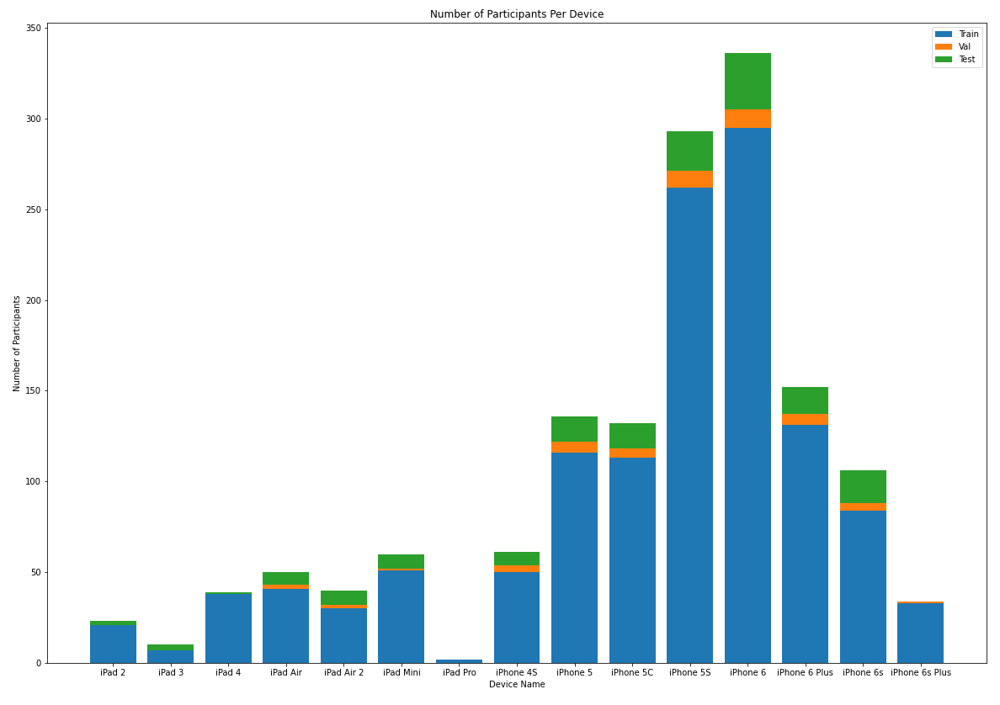

Details of the file structure within the dataset and what information is contained are explained very well at the [Official GazeCapture git repo](https://github.com/CSAILVision/GazeCapture). 

For training the network and the different experiments, we split this large dataset based on a variety of filters and train/test/val combinations. These splits and how to generate them using the code are briefly described below. 

### Key Point Generation
Since the Google Model requires eye landmark key points that are not included in the GazeCapture dataset, converting from GazeCapture to a dataset usable for this project is a two step process. 
1. Extract gazecapture.tar to a temp folder
2. Extract *.tar.gz into the same temp folder
3. Use one of the dataset conversion scripts in `Utils/dataset_converter*` to change the folder structure to a usable one 
4. Use the [Utils/add_eye_kp.py](https://github.com/DSSR2/gaze-track/blob/main/Utils/add_eye_kp.py) file to generate the key points. 

### MIT Split
All frames that make it to the final dataset contains only those frames that have a valid face detection along with valid eye detections. If any one of the 3 detections are not present, the frame is discarded. 

The _MIT Split_ maintains the train test validation split at a per participant level, same as what GazeCapture does. What this means is that a data from one participant does not appear in more than one of the train/test/val sets. We have different participants in the train, val and test sets. This ensures that the trained model is truly robust and can generalize well.

You can use the [Utils/dataset_converter_mit_split.py](https://github.com/DSSR2/gaze-track/blob/main/Utils/dataset_converter_mit_split.py) file to generate the two datasets mentioned below.

#### Only Phone Only Portrait
The first dataset we will discuss is the closest to what Google used to train their model. We apply the following filters:
* Only phone data
* Only portrait orientation
* Valid face detections
* Valid eye detections 

This dataset is what the [provided base model](https://github.com/DSSR2/gaze-track/blob/main/Checkpoints/GoogleCheckpoint_MITSplit.ckpt) is trained on. 

The figure below shows the distribution of number of frames per device. 
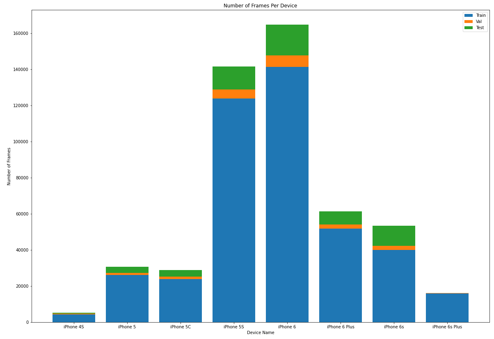

Overall, there were
* 501,735 Total frames from 1,241 participants
* 427,092 Train frames from 1,075  participants
* 19,102 Validation frames from 45 participants
* 55,541 Test frames from 121 participants

#### Only Phones All Orientations
The next dataset continues to split the data as suggested by GazeCapture but includes all the orientations. The following filters are applied: 
* Only phone data
* Valid face detections
* Valid eye detections

This dataset is used to train the model described in the `Experiments` folder. 

The figure below shows the distribution of number of frames per device. 
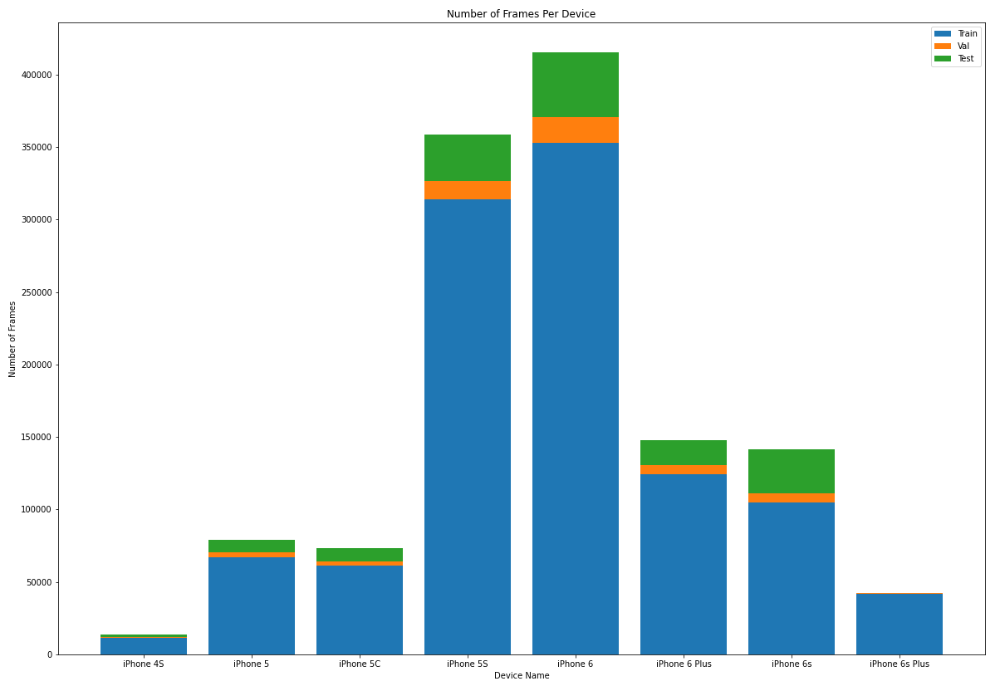

Overall, there were
* 1,272,185 Total frames from 1247 participants 
* 1,076,797 Train frames from 1081 participants
* 51,592 Validation frames from 45 participants
* 143,796 Test frames from 121 participants

### Google Split
Google split their dataset according to the unique ground truth points. This therefore means that frames from each participant are present in the train test and validation sets. To ensure no data leaks though, frames related to a particular ground truth point do not appear in more than one set. The split is also a random 70/10/15 train/val/test split compared to a 13 point calibration split. 

This dataset is what the [GoogleSplit Model](https://github.com/DSSR2/gaze-track/blob/main/Checkpoints/GoogleCheckpoint_GoogleSplit.ckpt) is trained on.

The figure below shows the distribution of number of frames per device. 
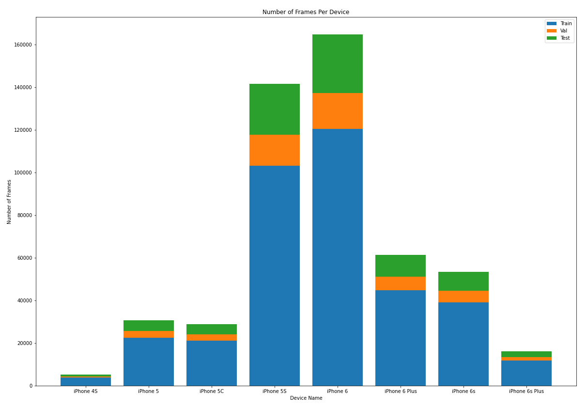

You can use the [Utils/dataset_converter_google_split.py](https://github.com/DSSR2/gaze-track/blob/main/Utils/dataset_converter_google_split.py) file to generate this dataset.

Overall, there were
* 501,735 Total frames from 1,241 participants
* 366,940 Train frames from 1,241  participants
* 50,946 Validation frames from 1,219 participants
* 83,849 Test frames from 1,233 participants


### Test Set
Results are reported on the entire test set and also on a subset of the entire test set split according to the two methods below. 

The paper claims that per person personalization greatly improves the performance of the system. This personalization is done using a simple SVR. To train the SVR, we split the test set into training and testing sets. 

#### 13 Point Calibration Split for SVR Training
In the first split, we choose the 13 point calibration data as the training set for the SVR and the rest of the 17 ground truth points serve as the test set. All frames related to each of the ground truth points are segregated into their respective sets to ensure no data leakage. 

The image below shows an example of this split. 
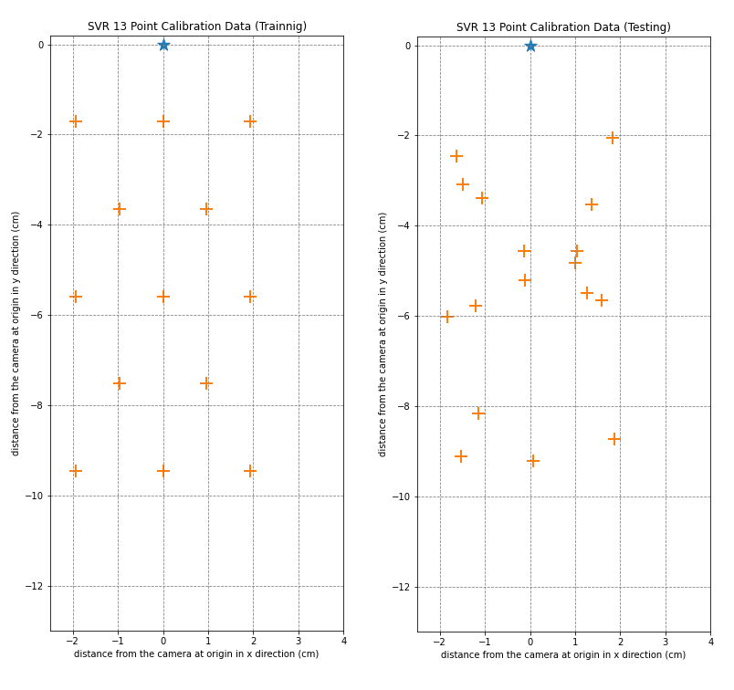

Details of this test set:
* Total number of files: 55,541
* Total number of participants: 121
* Total number of train files: 21,867
* Total number of test: 33,674

### 70/30 Split for SVR Training

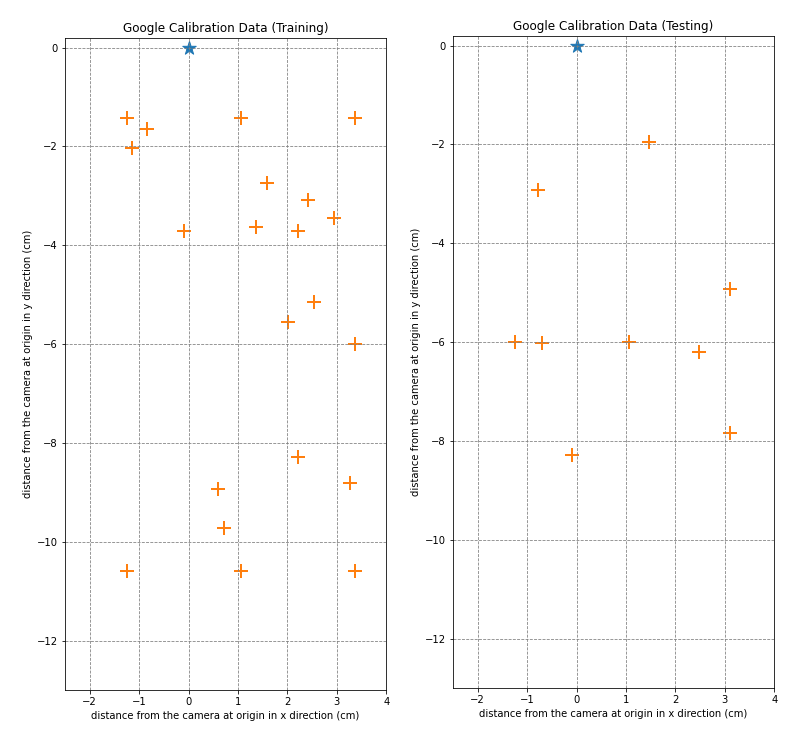

Details of this test set:
* Total number of files: 55,541
* Total number of participants: 121
* Total number of train files: 38,892
* Total number of test: 16,649

***

## The Network
We reproduce the network as provided in the Google paper and the supplementary information. 

The figure below shows the network architecture. 
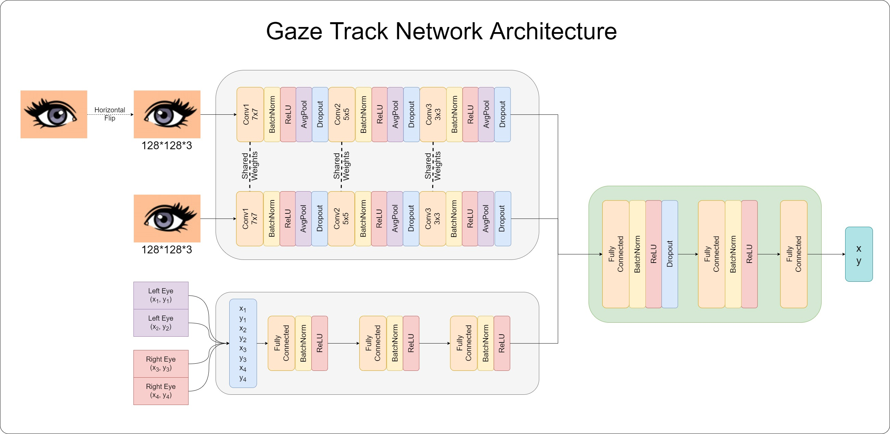

***

## Training
We use PyTorch Lightning to train our model. We leverage multiple GPUs and make sure to use all the resources available. Since the network is relatively small ~140K parameters, training speeds are fast. 

We use an Exponential Learning rate scheduler. Experiments were carried out with Exponential LR, Reduce LR on Plateau and no LR schedulers. The Exponential LR scheduler provided the best model. This is also similar to what Google mentions in their paper. 

***

## Results

### Base Model Results
The table below summarizes the results obtained using the trained models provided. 

These results are slightly worse than Google's reported errors since we have less restrictions on our data. 
<table>
<thead>
  <tr>
    <th>Model Name</th>
    <th>Dataset Name</th>
    <th>Number of Overall Test Files</th>
    <th>Test Error Overall (cm)</th>
    <th>Number of Non Calibration Test Points</th>
    <th>Test Error Non Calibration Points (cm)</th>
  </tr>
</thead>
<tbody>
  <tr>
    <td rowspan="7">GoogleCheckpoint_MITSplit.ckpt</td>
    <td>MIT Split; All phones, Only portrait</td>
    <td>55,541</td>
    <td>2.038 cm</td>
    <td>33,674</td>
    <td>1.92 cm</td>
  </tr>
  <tr>
    <td>MIT Split; Only iPhone 4S, Only portrait</td>
    <td>522</td>
    <td>2.04 cm</td>
    <td>NA</td>
    <td>NA</td>
  </tr>
  <tr>
    <td>MIT Split; Only iPhone 5, Only portrait</td>
    <td>3,362</td>
    <td>1.75 cm</td>
    <td>1,883</td>
    <td>1.61 cm</td>
  </tr>
  <tr>
    <td>MIT Split; Only iPhone 5S, Only portrait</td>
    <td>12,648</td>
    <td>1.95 cm</td>
    <td>7,158</td>
    <td>1.85 cm</td>
  </tr>
  <tr>
    <td>MIT Split; Only iPhone 5C, Only portrait</td>
    <td>3,643</td>
    <td>1.87 cm</td>
    <td>2,072</td>
    <td>1.70 cm</td>
  </tr>
  <tr>
    <td>MIT Split; Only iPhone 6, Only portrait</td>
    <td>16,993</td>
    <td>2.05 cm</td>
    <td>9,683</td>
    <td>1.98 cm</td>
  </tr>
  <tr>
    <td>MIT Split; Only iPhone 6S, Only portrait</td>
    <td>11,178</td>
    <td>1.91 cm</td>
    <td>7,777</td>
    <td>1.75 cm</td>
  </tr>
  <tr>
    <td>GoogleCheckpoint_GoogleSplit.ckpt</td>
    <td>Google Split; All phones, Only portrait</td>
    <td>83,849</td>
    <td>1.86cm</td>
    <td>NA</td>
    <td>NA</td>
  </tr>
</tbody>
</table>

### SVR Personalization
We take the output of the penultimate ReLU layer from the base model and train a per person SVR to provide a personalized result. The SVR leads in a reduction in the overall mean error but there are a few cases where the SVR hurts performance.

The results are summarized in the table below. 
<table>
<thead>
  <tr>
    <th>Dataset</th>
    <th>Number of Test Files</th>
    <th>Base Model Mean Error (cm)</th>
    <th>Mean Error After SVR(cm)</th>
    <th>Improvement (cm)</th>
  </tr>
</thead>
<tbody>
  <tr>
    <td>SVR 13 Point Calibration</td>
    <td>33,674</td>
    <td>1.91</td>
    <td>1.79</td>
    <td>0.12</td>
  </tr>
  <tr>
    <td>SVR 70/30 Point Split</td>
    <td>16,649</td>
    <td>2.03</td>
    <td>1.87</td>
    <td>0.16</td>
  </tr>
</tbody>
</table>

Since the 13 point calibration set uses the ground truth points that are at the edges of the screen for training, the test set contains more points that tend to the centre of the screen. Hence the base model error on the SVR 13 point calibration dataset is considerably lower than the 70/30 split set. 

But since the SVR is trained on more data in the 70/30 split dataset, we see the delta between pre SVR and post SVR error is larger which shows better personalization. 

#### 13 Point Calibration Split
The SVR reduces the mean overall error from 1.9187cm to 1.8124cm. This is a good result considering there are few cases where the SVR actually harms performance. 

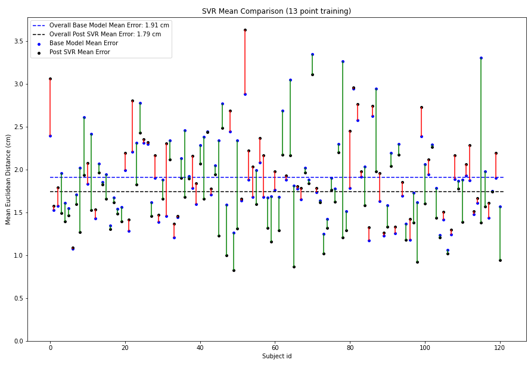

#### Google 70/30 Train Test Split
The SVR reduces the mean overall error from 2.03cm to 1.87cm
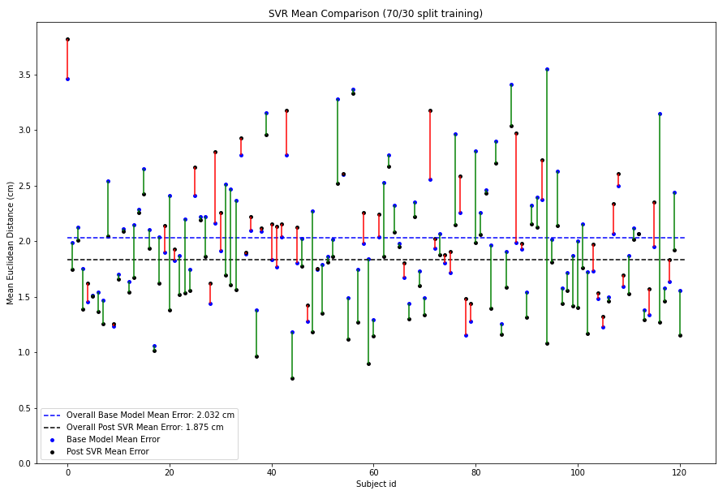

### SVR Outputs
The figures below show how the SVR improves on the predictions made by the base model. 

The '+' signs are the ground truth gaze locations and the dots are network predictions. Each gaze location has multiple frames associated with it and hence has multiple predictions. To map predictions to their respective ground truth, we use color coding. All dots of a color correspond to the '+' of the same color. The camera is at the origin(the star). To visualize what the SVR is doing, we also plot lines between network predictions and corresponding SVR predictions. 

The SVR training is also plotted for the 13 point calibration data. The patterns learnt in this calibration are applied on the test set. Since there are many points, there is also an easier to view centroid plot. This averages all the predictions for a single ground truth to give the centroid of the predictions for that ground truth.

<h4>Examples where SVR helps</h4>
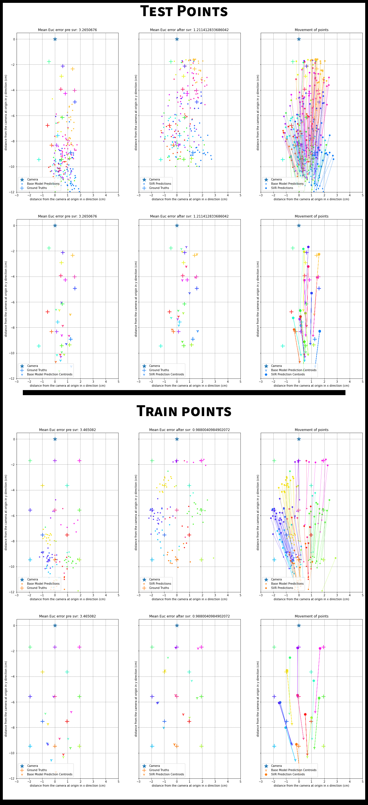
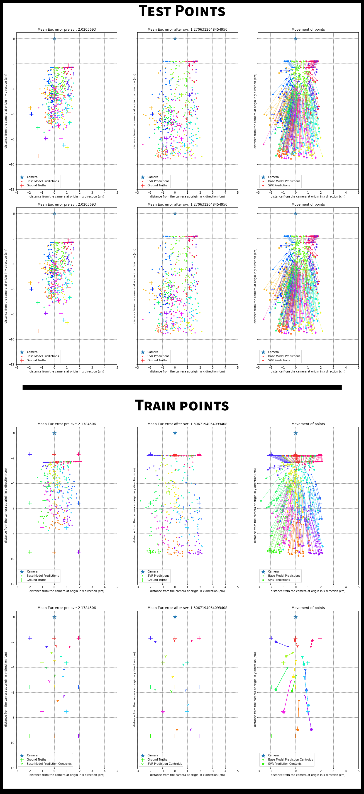
<h4>Examples where SVR hurts</h4>
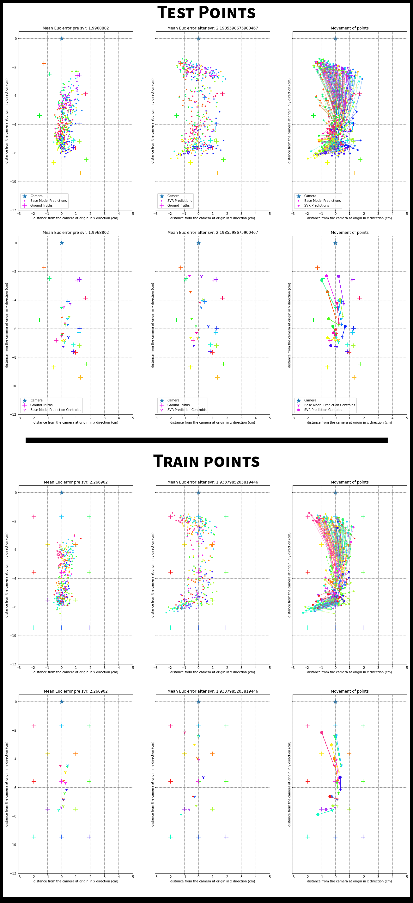
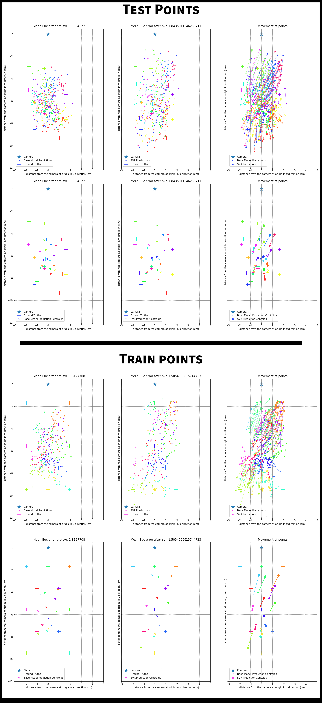

### Affine Transform Based Personalization
Looking at the predictions of the network, it seems like a simple affine transform can also be learnt that can improve accuracy. We use the network predictions of the frames related to the 13 point calibration data to learn an affine transform. 

The allowed operations in an affine transform are shifting, scaling and rotating. 

Interestingly, the affine transform improves the base model error from 1.91cm to 1.859cm! While this delta is smaller than the delta we obtained with SVR training, the result is still significant. The affine transform tends to hurt performance in the cases with higher base model more than cases where base model error is low. 

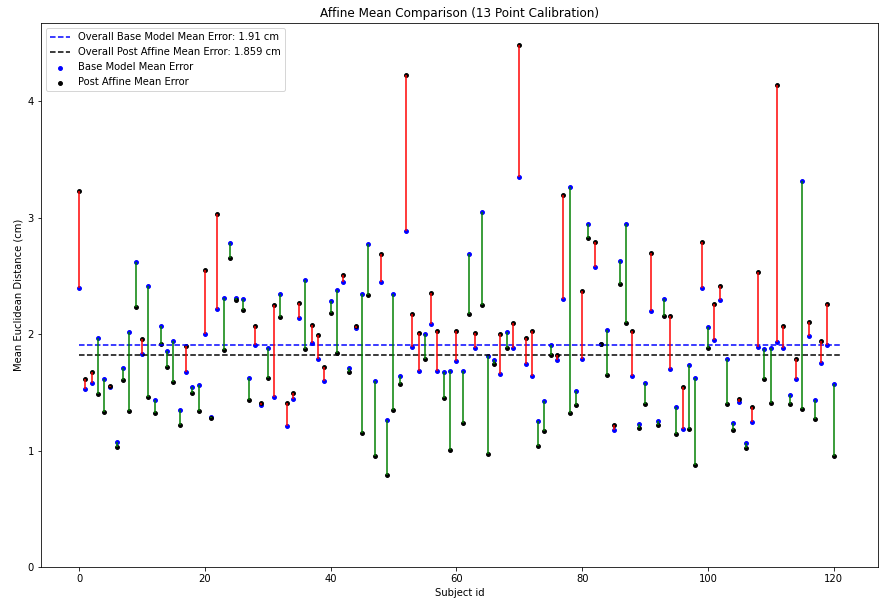

***

## Experiments
To test how good the actual architecture that the Google paper defines is, we ran an experiment to see how it compares to the model proposed by the MIT GazeCapture paper. 

### Network Architecture
Since the Google Architecture does not have any information about orientation of the device, we decided to send it a small _helper_ data packet. The network now receives, along with eye corner landmarks, a one hot encoded orientation vector. 
* `[0, 0, 1]` for portrait 
* `[0, 1, 0]` for landscape 1
* `[1, 0, 0]` for landscape 2

The modified architecture is seen in the image below. 
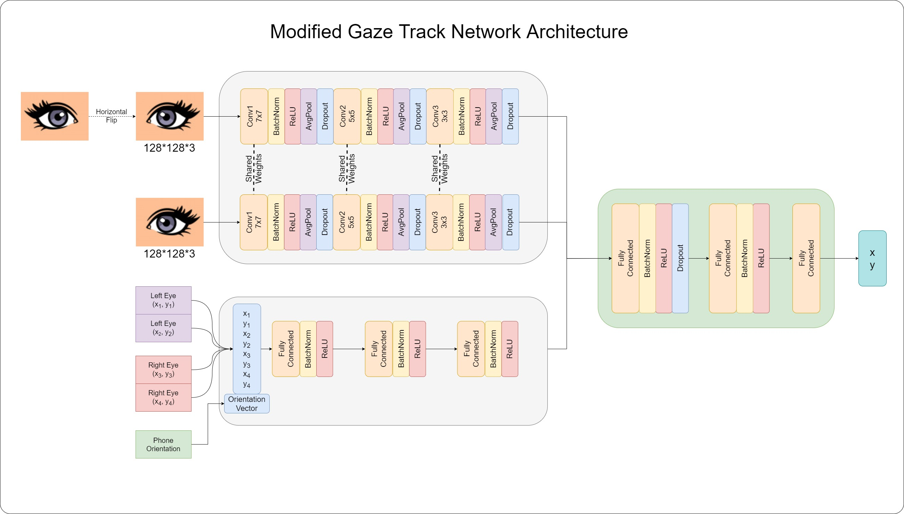

### Dataset
To train this network, we used the entire GazeCapture Dataset using only the following filters:
* Only phone data
* Valid face detections
* Valid eye detections. 

Eye key points were added to the entire dataset as described in the [Key Point Generation](#key-point-generation) section. 

Details of the dataset: 
* Total frames: 1,272,185
* Train frames: 1,076,796
* Val frames: 51,592
* Test frames: 143,796

### Training
We again use PyTorch Lightning. The percentage of dropout during training is increased throughout the architecture. Different schedulers and optimizers were tried and the best performing model was obtained using the Adam Optimizer and a ReduceLRonPlateau scheduler. 

### Results
The best model gave a mean Euclidian error of 2.01cm. The model that produced this is provided in [/Experiments/Checkpoints/checkpoint.ckpt](https://github.com/DSSR2/gaze-track/blob/main/Experiments/Checkpoints/checkpoint.ckpt)

The error of 2.01cm is even lower than GazeCapture's error when they do not use any augmentation! This goes to show the power of this architecture. This architecture has ~150K parameters while the GazeCapture dataset has ~7M parameters. 

While the error in centimetres is very low, it looks like the network has learned a "cheat" solution.

The image below shows all the possible ground truth locations (the '+') sign and all the predictions made by the network (the blue dots). All predictions are made in the unified prediction space with the camera (star) at (0,0). 

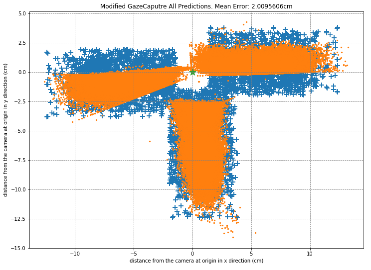

The three orientations - portrait, landscape with camera on right and landscape of camera on right - are all encompassed in this single image. While we see the distribution of the portrait orientation predictions are close to the actual ground truths, both the landscape predictions seem to "learn" boundaries that don't actually exist. 

The table below lists the mean errors per orientation. 
<table>
<thead>
  <tr>
    <th>Orientation</th>
    <th>Mean Error(cm)</th>
  </tr>
</thead>
<tbody>
  <tr>
    <td>Portrait orientation</td>
    <td>2.0337548</td>
  </tr>
  <tr>
    <td>Landscape, with home button on the right</td>
    <td>2.0637705</td>
  </tr>
  <tr>
    <td>Landscape, with home button on the left</td>
    <td>1.9330263</td>
  </tr>
</tbody>
</table>

This remains an open problem and could lead to interesting insights on how the network learns. 

***

## References
```
1. Eye Tracking for Everyone
K.Krafka*, A. Khosla*, P. Kellnhofer, H. Kannan, S. Bhandarkar, W. Matusik and A. Torralba
IEEE Conference on Computer Vision and Pattern Recognition (CVPR), 2016

2.Accelerating eye movement research via accurate and affordable smartphone eye tracking.
Valliappan, N., Dai, N., Steinberg, E., He, J., Rogers, K., Ramachandran, V., Xu, P., Shojaeizadeh, M., Guo, L., Kohlhoff, K. and Navalpakkam, V.
Nature communications, 2020
```

*** 

## Acknowledgements
I'd like to thank my awesome mentors [Dr. Suresh Krishna](https://www.mcgill.ca/physiology/directory/core-faculty/suresh-krishna) and [Dr. Vineet Gandhi](https://faculty.iiit.ac.in/~vgandhi/index.html#Misc). 

This project was carried out as a part of Google Summer of Code 2021.